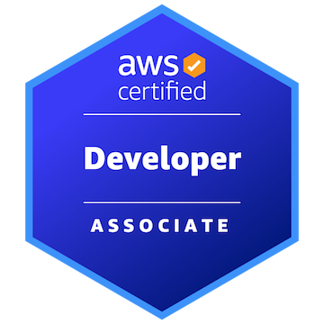

Hi there 👋 My name is Sai Sreenivas Reddy Karra 
==================
Computer Science Graduate from Saint Louis University (  ).
==================
Hello! I’m Sai Sreenivas Reddy Karra, a dedicated Full-Stack Developer with a passion for crafting scalable, efficient, and innovative solutions. With a strong foundation in both front-end and back-end development, my expertise spans a range of technologies and methodologies that enable me to build dynamic, high-performance applications.

I specialize in designing and implementing full-stack solutions using a diverse technology stack, including Java, Spring Boot, React/Redux, Vue.js, and Node.js. My experience encompasses creating responsive and scalable web applications, designing robust RESTful APIs, and managing databases to ensure data integrity and performance.

I’m also well-versed in cloud computing with AWS, where I leverage services like EC2, Lambda, API Gateway, and S3 to enhance application scalability, reliability, and performance. My expertise extends to continuous integration and deployment (CI/CD) using Jenkins, automating testing processes with tools like Selenium and Storybook, and employing Git for version control to maintain code quality and foster team collaboration.

My approach to development is driven by a commitment to continuous learning and improvement. I focus on delivering solutions that are not only functional but also optimized for performance and scalability. I enjoy collaborating with cross-functional teams, employing Agile methodologies to streamline processes and adapt to evolving project requirements.

I’m always open to new challenges and opportunities to grow as a developer. Whether you’re interested in discussing a potential collaboration, exploring new technologies, or just exchanging ideas, feel free to connect with me. Explore my repositories to see some of the projects I’ve worked on and get a sense of my approach to problem-solving and innovation.

* 🌍  I'm based in Irvine, CA. 
* 🖥  See my portfolio at [Portfolio](https://sreenivas98.github.io/my-portfolio)
* ✉  You can contact me at [srivatsava.sai@gmail.com](mailto:srivatsava.sai@gmail.com) 
* 🤝  I'm open to collaborating on Automating the boring and tedious tasks and work on any full stack projects related to Java, Python, C# or JavaScript.

### Skills  

             <a href="https://aws.amazon.com/free/?gclid=Cj0KCQjwu8uyBhC6ARIsAKwBGpRU1iksOOarn0EzbANmjwry1CuLDqNEjcRac4xmHU7CVbtW7mtN0HwaAov-EALw_wcB&trk=6a4c3e9d-cdc9-4e25-8dd9-2bd8d15afbca&sc_channel=ps&ef_id=Cj0KCQjwu8uyBhC6ARIsAKwBGpRU1iksOOarn0EzbANmjwry1CuLDqNEjcRac4xmHU7CVbtW7mtN0HwaAov-EALw_wcB:G:s&s_kwcid=AL!4422!3!651751059780!e!!g!!aws!19852662197!145019195897&all-free-tier.sort-by=item.additionalFields.SortRank&all-free-tier.sort-order=asc&awsf.Free%20Tier%20Types=*all&awsf.Free%20Tier%20Categories=*all" target="_blank" rel="noreferrer"></a> 

### Certifications

 

### PERSONAL PROJECTS
 
<ul>
 <li>Portfolio Website (SPA): This SPA portfolio website includes a Home Page, About Page, Projects Page, and Resume Page, all crafted with React JS, HTML and CSS for a sleek, responsive design. ( TechStack Used - React JS, HTML, CSS ).</li>
 <li>MNIST Digit Classifier: Developed and trained various machine learning models, including deep neural networks and decision trees, to classify handwritten digits. Designed a React frontend and Python backend using Flask Web Services Framework. ( TechStack Used - Python, Flask, React, numpy, pandas, pickle, sklearn, keras).</li>
 <li>Drone Plane Remote iOS Application: Built an iOS app with React Native to control drones and designed a Flask backend to handle commands and communication. ( TechStack Used - React Native, Python, Flask WebService Framework, Dronekit library ).</li>
 <li>Weather Prediction Windows Application: Built a standalone windows app using Java that gets either the zip code or city name from the user and displays current weather in that place by querying a 3rd party weather api. (TechStack Used: Java ).</li>

### Socials  

   

### My GitHub Stats

 

<!--
**sreenivas98/sreenivas98** is a ✨ _special_ ✨ repository because its `README.md` (this file) appears on your GitHub profile.

Here are some ideas to get you started:

- 🔭 I’m currently working on ...
- 🌱 I’m currently learning ...
- 👯 I’m looking to collaborate on ...
- 🤔 I’m looking for help with ...
- 💬 Ask me about ...
- 📫 How to reach me: ...
- 😄 Pronouns: ...
- ⚡ Fun fact: ...
-->
